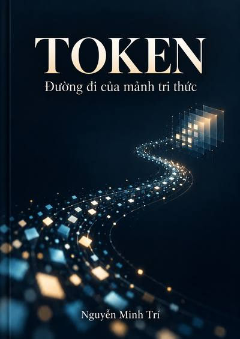

# TOKEN — The Journey of a Fragment of Knowledge

  

**Author:** Nguyễn Minh Trí  
**Original title:** *TOKEN — Đường đi của mảnh tri thức*  
**Current status:** Free Research Edition

This repository is the canonical home of **TOKEN — The Journey of a Fragment of Knowledge**.

The book follows one token from text into numerical representation, through Transformer computation, down to runtime and physical execution, then back through traces, measurements, evidence, and the limits of what we are justified in claiming.

## Editions

- 🇻🇳 **Vietnamese Research Edition:** [`vi/README.md`](./vi/README.md)
- 🇬🇧 **English Edition:** planned after the commercial editorial audit. It has **not** been translated yet.

The GitHub research edition remains freely readable. Future commercial reader editions may differ in editing, typography, illustrations, indexing, packaging, and format while preserving the scientific evidence and its stated limits.

## Research-derived, not theory-only

Examples based on real experiments are kept distinct from illustrative numbers. Failed or unresolved evidence is not rewritten into a successful story. Where the evidence does not justify a causal or mechanistic conclusion, the book says so explicitly.

## Copyright and citation

Copyright © 2026 Nguyễn Minh Trí. All rights reserved.

The work is freely accessible for reading in this public repository. Public availability does not grant permission to republish, sell, translate, adapt, or redistribute the book outside rights granted by applicable law or GitHub's platform terms. See [`LICENSE.md`](./LICENSE.md).

For academic or technical citation, see [`CITATION.cff`](./CITATION.cff).

## Publication roadmap

1. Freeze the Vietnamese research baseline.
2. Run `TOKEN_COMMERCIAL_EDITORIAL_AUDIT_V1`.
3. Produce the Vietnamese Reader Edition.
4. Adapt—not mechanically translate—the book into English.
5. Native-English technical edit.
6. Digital beta release, then international ebook/print release.
